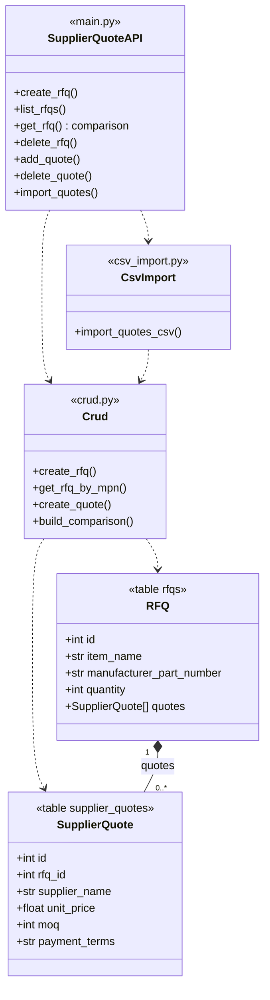

# RFQ's

# Comparison

# LLD UML DIAGRAM

```mermaid
classDiagram
    direction TB

    class SupplierQuoteAPI {
        <<main.py>>
        +create_rfq()
        +list_rfqs()
        +get_rfq() comparison
        +delete_rfq()
        +add_quote()
        +delete_quote()
        +import_quotes()
    }

    class Crud {
        <<crud.py>>
        +create_rfq()
        +get_rfq_by_mpn()
        +create_quote()
        +build_comparison()
    }

    class CsvImport {
        <<csv_import.py>>
        +import_quotes_csv()
    }

    class RFQ {
        <<table rfqs>>
        +int id
        +str item_name
        +str manufacturer_part_number
        +int quantity
        +SupplierQuote[] quotes
    }

    class SupplierQuote {
        <<table supplier_quotes>>
        +int id
        +int rfq_id
        +str supplier_name
        +float unit_price
        +int moq
        +str payment_terms
    }

    SupplierQuoteAPI ..> Crud
    SupplierQuoteAPI ..> CsvImport
    CsvImport ..> Crud
    Crud ..> RFQ
    Crud ..> SupplierQuote
    RFQ "1" *-- "0..*" SupplierQuote : quotes
```
